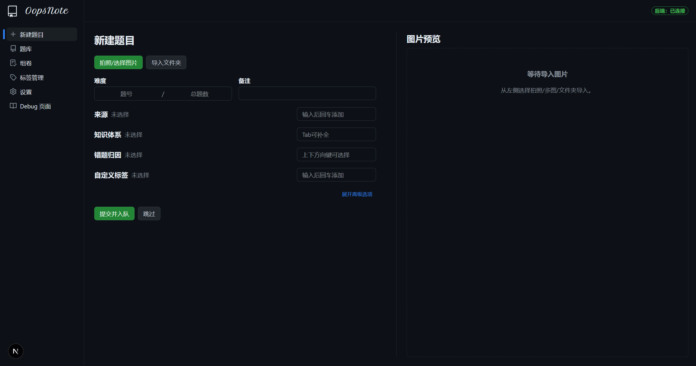
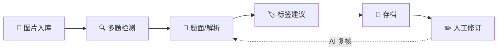

<div align="center">

#  

**面向理科学科的 AI 驱动错题整理平台**

支持图片识别、题面重建、自动解析、标签打标与档案管理，并预留 Web 端的二次编辑与协同流程。



</div>

---

<!-- shields.io badges -->
<p align="center">
  
  
  
  
</p>

<p align="center">
  
  
  
  
</p>

<p align="center">
  
  
  
  
</p>

---

---

## 📋 TODO

### ✅ 已完成

- [x] 导入文件夹时优化操作
    - 每个提交后，焦点自动跑到难度框，方便 tab，而非保留道提交并入队
- [x] 组卷功能增强
    - [x] 组卷科目 filter
    - [x] 组卷全选按钮
- [x] 题目学科自动识别
    - [x] 默认学科为"自动识别"
- [x] 当组卷错误时，保存日志和错误的 tex 文件
- [x] 去除填空题自动占位
- [x] 优化 tagger.md

---

## 🎯 项目目标

- **📸 自动收集**：通过拍照/上传，将纸质或屏幕题目快速数字化。
- **🔍 精准识别**：多题目检测、主体定位、LaTeX 格式化的题面重建。
- **🤖 多 Agent 协同**：拆分为识别、求解、解析、打标、存档等独立阶段，互相回溯。
- **📚 错题知识库**：结构化存储题面、解析、标签、原图，供 Web 端二次编辑与回放。
- **🔄 闭环迭代**：每次人工修改都可触发自动复核/标签建议，提升档案质量。

## 🏗️ 总体架构

```text
+------------------+      +-----------------+      +-------------------+
|  Web / 移动端 UI  | ---> |  Agent Router   | ---> |   Agent Pipeline   |
|  - 上传/裁剪      |      |  - 状态机        |      | 1. 题块检测         |
|  - 题目编辑      |      |  - 回滚控制      |      | 2. OCR+重建        |
|  - 标签管理      |      |  - AI 调度       |      | 3. 求解/解析       |
+------------------+      +-----------------+      | 4. 标签建议        |
                                                   | 5. 存档与回写       |
                                                   +-------------------+
                                                       ↓
                                                +-------------------+
                                                |  数据与向量存储    |
                                                |  - Postgres + S3   |
                                                |  - pgvector 检索   |
                                                +-------------------+
```

**当前实现：**

| 层级 | 技术栈 | 职责 |
| :--- | :--- | :--- |
| **🎨 客户端** | Next.js | 上传、任务页回放、题库编辑、标签管理 |
| **🔙 后端** | FastAPI | 任务状态机、SSE 流式、OCR/解题/打标串联与落盘 |
| **💾 存储** | 本地文件 | 便于本地开发/回放；后续可替换为 DB/S3 |

> ⚠️ **注意**：错误详情记录在 `storage/llm_errors.log`

## 📁 项目结构

```text
OopsNote/
├─ 📄 README.md          # 项目概览与架构
├─ 🤖 AGENTS.md          # Agent 流程与提示词（与当前后端实现保持一致）
├─ 🎨 frontend/          # Next.js Web 客户端
├─ 🔙 backend/           # FastAPI + agents + file storage
└─ 📚 docs/              # 辅助文档（可选）
```

> 📖 **说明**：Agent 流程与提示词说明见 [`AGENTS.md`](AGENTS.md)；后端 API/存储说明见 [`backend/README.md`](backend/README.md)。

## 🚀 运行

### ⚡ VS Code 一键拉起（推荐）

已提供 VS Code Task：同时启动后端与前端。

1. 打开命令面板：`Terminal: Run Task`
2. 选择：`dev: all`

> 💡 **提示**：首次启动前端会自动执行一次 `npm install`；后端请先按下方步骤安装依赖。

### 🔙 后端

**使用 uv（推荐）**

```bash
cd OopsNote/backend
uv sync --dev
uv run uvicorn app.main:app --reload --host 0.0.0.0 --port 8000
```

**或使用 pip**

```bash
cd OopsNote/backend
python -m pip install -e .[dev]
uvicorn app.main:app --reload --host 0.0.0.0 --port 8000
```

<p align="right">
  
</p>

### 🎨 前端

```bash
cd OopsNote/frontend
npm install
npm run dev
```

<p align="right">
  
</p>

### 📄 LaTeX 论文版式测试

前端提供 `http://localhost:3000/latex-test`，支持将 LaTeX 内容编译为 PDF 预览（非实时）。

要求本机安装 TeX 发行版（推荐 TeX Live），并确保 `xelatex` 可被后端找到：

- 方式一：加入系统 PATH（如 `C:\\texlive\\2025\\bin\\windows`）
- 方式二：设置环境变量 `XELATEX_PATH` 指向 `xelatex.exe`

<p align="right">
  
</p>

### 🧪 渲染测试（化学方程式 / 流程图）

仓库内提供一个用于验证 KaTeX（含 mhchem 化学方程式）、chemfig SVG 以及 Mermaid 流程图渲染的 demo 任务（不会直接提交到 `backend/storage/`，需要本地 seed 一次）：

```bash
D:\works\2025\OopsNote\.venv\Scripts\python.exe backend/scripts/seed_demo_tasks.py
```

启动后端/前端后，在任务页打开：

- `http://localhost:3000/tasks/c10f6c74b5e34c0d9b4b62d3b2c2a110`

> 💡 **说明**：数学文本默认由 KaTeX 渲染；chemfig 结构式通过后端 `POST /latex/chemfig` 转为 SVG 在前端展示。

<p align="right">
  
  
</p>


默认后端地址为 `http://localhost:8000`，可通过 `frontend/.env` 配置：

```bash
NEXT_PUBLIC_BACKEND_URL=http://localhost:8000
```

## ⚙️ 环境变量

建议把环境变量写入各自目录的 `.env` 文件（不要提交到仓库）。

| 位置 | 变量 | 说明 |
| :--- | :--- | :--- |
| **🔙 后端** | `OPENAI_API_KEY` | OpenAI API 密钥 |
| | `OPENAI_BASE_URL` | OpenAI API 基础 URL（可选） |
| | `GEMINI_API_KEY` | Google Gemini API 密钥 |
| | `XELATEX_PATH` | LaTeX 引擎路径（可选） |
| **🎨 前端** | `NEXT_PUBLIC_BACKEND_URL` | 后端 API 地址 |

**配置说明：**

- 后端：支持每个 agent 单独配置（见 [`backend/README_AGENT_CONFIG.md`](backend/README_AGENT_CONFIG.md)）
- 前端：复制 [`frontend/.env.example`](frontend/.env.example) 为 `frontend/.env`

> ⚠️ **注意**：`.env` 文件应只用于本地/部署环境配置，不应提交到仓库（已在 `.gitignore` 中忽略）。

## ✅ 已实现能力（摘要）

| 功能模块 | 描述 |
| :--- | :--- |
| **📝 任务管理** | 上传图片创建任务、查看任务状态与解析结果 |
| **📡 流式输出** | SSE 实时输出 + 刷新后回放历史流式文本 |
| **🚫 任务控制** | 任务处理中可停止并标记作废 |
| **🏷️ 标签系统** | 四维标签（知识体系/错题归因/题目属性/自定义）+ 颜色样式可配置 + 模糊搜索/新建 + 未输入时按引用次数推荐 Top 标签 |
| **📚 题库管理** | 汇总所有题目，支持编辑题号/来源/题干/标签、复制 Markdown、删除题目/任务 |

## 💡 下一步建议

1. **🎨 前端原型**：基于 `skid-homework` 的 ScanPage 交互，复用上传/预览/错题卡片组件。
2. **🤖 Agent Orchestrator**：选型 LangChain ReAct、Function Calling 或自建状态机，实现 5 阶段语义路由。
3. **💾 数据落地**：设计 Postgres schema（题目、标签、版本、编辑日志）与对象存储策略。
4. **📝 提示词迭代**：在 `AGENTS.md` 的草案基础上，结合真实题图持续 A/B。
5. **🔁 编辑闭环**：实现 Web 端的"修改→触发 AI 复核/再打标"流程，与版本 diff 结合。

## 🗺️ 指挥图 (示例进程)



**详细流程：**

1. **📸 图片入库**：用户上传 -> 客户端生成唯一任务 ID。
2. **🔍 多题检测**：Agent#1 返回裁剪坐标数组 -> 保存 crop 元数据。
3. **📝 题面/解析**：Agent#2 & #3 输出结构化 XML/JSON，写入临时表。
4. **🏷️ 标签建议**：Agent#4 根据题面/解析/历史错因生成多维标签。
5. **💾 存档**：Agent#5 合并原图、裁剪图、文本、标签入库；触发 Web 端刷新。
6. **✏️ 人工修订**：前端提交补充说明 -> Agent 工具化辅助再打标。

## 📦 依赖与运行（补充）

- **💻 语言**：TypeScript / Python（或 Node.js 全栈，视 Agent 选型而定）。
- **🧠 模型**：GPT-4o, Claude 3.5 Sonnet, Gemini 2.0 Flash, Qwen-VL-Max 等可替换。
- **🗄️ 向量库**：pgvector / Supabase Vector / Pinecone（视部署环境）。

后端本地默认使用 stub client；配置 API key 后会启用真实模型。

<p align="center">
  
  
  
  
</p>

## 📄 许可

尚未指定开源协议；默认遵循企业/团队内部规范，可在成型后补充。

---

## 📬 联系与贡献

- **🐛 问题反馈**：[GitHub Issues](https://github.com/34LiuNian/OopsNote/issues)
- **📧 联系我们**：通过 GitHub Issues 或 Pull Request
- **🤝 贡献代码**：欢迎提交 PR，请先阅读贡献指南

---

<div align="center">

**Made with ❤️ by OopsNote Team**

[🔝 返回顶部](#oopsnote)

</div>

