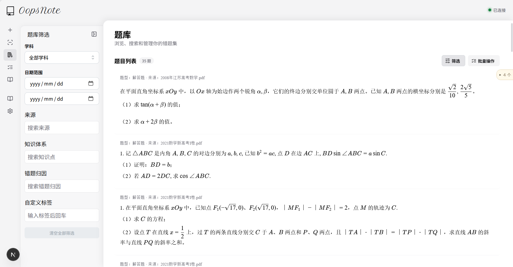

<div align="center">

<picture>
  <source media="(prefers-color-scheme: dark)" srcset="assets/favicon_white.svg">
  
</picture>
<br/>
<picture>
  <source media="(prefers-color-scheme: dark)" srcset="assets/oopsnote_white.svg">
  
</picture>

<h2>AI 驱动的个人错题管理工具</h2>

扫描作业 → AI 自动识别/解题/打标 → 积累个人错题库 → 针对性复习

<picture>
  <source media="(prefers-color-scheme: dark)" srcset="assets/page1_dark.png">
  
</picture>

</div>

---

<p align="center">
  
  
  
  
</p>

<p align="center">
  
  
  
</p>

---

## 🏗️ 架构

```
Hermes (自然语言)    Web 前端 (上传/浏览)    Obsidian (知识图谱)
       │ MCP                │ REST                  ▲ 文件
       ▼                    ▼                      │
  ┌────────────────────────────────────────────┐    │
  │            OopsNote Core (Python)           │────┘
  │  models · store · tags · search · mcp       │
  └────────────────────────────────────────────┘
```

**Hermes Agent** 管理所有 AI：OCR、解题、打标，通过 MCP 协议与 Core 通信。profile 隔离保证错题处理与日常聊天互不干扰。

> 完整产品设计见 [`docs/ARCHITECTURE.md`](docs/ARCHITECTURE.md)

---

## 📁 项目结构

```
OopsNote/
├── oopsnote/             ← Core 库
│   ├── core/             # 数据模型、存储、标签、搜索
│   ├── mcp/              # MCP Server（→ Hermes）
│   ├── api/              # REST API（→ 前端）
│   ├── cli/              # CLI 调试入口
│   ├── obsidian/         # Obsidian 同步（Phase 3）
│   └── paper/            # LaTeX 试卷编译
├── frontend/             ← Next.js 前端（Phase 4）
├── tests/                ← 测试
└── docs/                 ← 文档
```

---

## 🚀 使用

### 安装

```bash
git clone https://github.com/34LiuNian/OopsNote.git
cd OopsNote
uv sync
```

### 运行测试

```bash
uv run pytest -v
```

### CLI（调试用）

```bash
uv run python -m oopsnote.cli.main scan ./试卷.pdf --subject 数学
uv run python -m oopsnote.cli.main search --tags "二次函数"
```

### Hermes 入口（主入口）

```bash
# 创建独立 profile
hermes profile create oopsnote

# 开始使用
hermes --profile oopsnote
> 扫一下这本练透数学选必一
> 帮我找二次函数相关的错题
```

Hermes 配置见 [`docs/ARCHITECTURE.md`](docs/ARCHITECTURE.md) 第六章。

---

## 📋 实施进度

| Phase | 内容 | 状态 |
|-------|------|------|
| 1 | Core 骨架（数据模型/存储/标签/搜索） | ✅ |
| 2 | Hermes 集成（MCP Server + Skills） | ✅ |
| 3 | Obsidian 同步 + 搜索 API | 待开始 |
| 4 | 前端简化 | 待开始 |
| 5 | 知识体系 + 智能出卷 | 远期 |

---

## 📄 许可

AGPL-3.0

## 🙏 致谢

- [**Hermes Agent**](https://github.com/NousResearch/hermes-agent) — AI 引擎
- [**Primer**](https://primer.style/) — UI 框架
- [**imsyy/home**](https://github.com/imsyy/home) — Loading 页参考
- 标签数据来源：[filatex.cn](https://filatex.cn/) · [wrong-notebook](https://github.com/wttwins/wrong-notebook)

---

<div align="center">

**Made with ❤️ by 34LiuNian**

</div>
